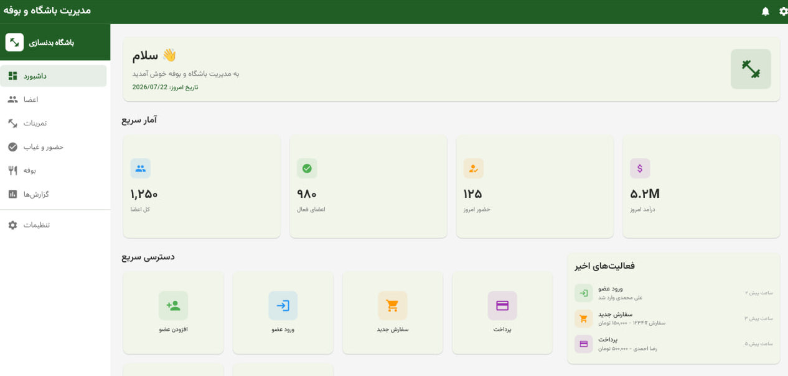

<div dir="rtl">

# 🏋️ مدیریت باشگاه و بوفه

<div align="center">


**سیستم جامع مدیریت باشگاه بدنسازی و بوفه - کاملاً آفلاین**

</div>

---

## 📱 معرفی برنامه

**مدیریت باشگاه و بوفه** یک اپلیکیشن جامع و حرفه‌ای برای مدیریت باشگاه‌های بدنسازی است. این برنامه **کاملاً آفلاین** کار می‌کند و نیازی به اینترنت ندارد.


## اسکرین شات

<div align="center">
  
</div>
### ✨ ویژگی‌های کلیدی

| ویژگی | توضیح |
|--------|-------|
| 🔒 **امنیت بالا** | رمزگذاری پایگاه داده، احراز هویت بیومتریک |
| 📱 **کاملاً آفلاین** | بدون نیاز به اینترنت |
| 🎨 **رابط کاربری زیبا** | طراحی مدرن با پشتیبانی RTL |
| 📊 **گزارش‌گیری پیشرفته** | گزارش‌های روزانه، ماهانه و سالانه |
| 💰 **حسابداری کامل** | پیگیری درآمد، هزینه و سود |
| 🍽️ **مدیریت بوفه** | مدیریت محصولات و سفارشات |

---

## 🎯 ماژول‌های اصلی

### 👥 مدیریت اعضا
- ثبت‌نام و مدیریت پروفایل اعضا
- پیگیری وضعیت عضویت (فعال/منقضی/تعلیق)
- تاریخچه پرداخت و مانده حساب
- سوابق سلامت و اندازه‌گیری‌ها
- نمودار پیشرفت اعضا

### 🏋️ مدیریت تمرینات
- کتابخانه جامع تمرینات با دسته‌بندی
- برنامه‌های تمرینی شخصی‌سازی شده
- ثبت تمرینات اعضا
- پیگیری پیشرفت با نمودار
- محاسبه یک تکرار بیشینه (1RM)

### ✅ حضور و غیاب
- ثبت ورود و خروج (دستی/QR)
- تاریخچه حضور و غیاب
- گزارش ساعت‌های پیک
- ظرفیت‌سنجی سالن
- خروج خودکار در ساعت تعطیلی

### 🍽️ مدیریت بوفه
- کatalog محصولات با دسته‌بندی
- ثبت سفارش و پیگیری وضعیت
- سبد خرید
- مدیریت موجودی با هشدار کم بودن
- چاپ فاکتور

### 💵 حسابداری
- ثبت درآمد و هزینه
- مدیریت فاکتورها
- پیگیری پرداخت‌های معوق
- گزارش‌های مالی روزانه/ماهانه/سالانه
- صورت سود و زیان

### 📊 داشبورد و تحلیل
- آمار لحظه‌ای
- نمودارها و تجسم داده‌ها
- فعالیت‌های اخیر
- هشدارها و اعلان‌ها

---

## 🛠️ فناوری‌های استفاده شده

| فناوری | کاربرد |
|--------|--------|
| **Flutter 3.16** | فریمورک اصلی |
| **Dart 3.2** | زبان برنامه‌نویسی |
| **Vazirmatn** | فونت فارسی |
| **Floor** | ORM پایگاه داده SQLite |
| **Hive** | ذخیره‌سازی محلی |
| **BLoC** | مدیریت State |
| **GoRouter** | مسیریابی |
| **GetIt** | Dependency Injection |
| **PDF** | تولید PDF |
| **fl_chart** | نمودارها |

---

## 📁 ساختار پروژه

```
lib/
├── core/                    # هسته برنامه
│   ├── business/           # قوانین تجاری
│   ├── constants/          # ثابت‌ها
│   ├── database/           # پایگاه داده
│   ├── errors/             # مدیریت خطاها
│   ├── reports/            # سیستم گزارش‌گیری
│   ├── routes/             # مسیریابی
│   ├── security/           # امنیت
│   ├── services/           # سرویس‌ها
│   ├── themes/             # تم و استایل
│   └── utils/              # ابزارها
├── data/                   # لایه داده
│   ├── datasources/        # منابع داده
│   ├── mappers/            # تبدیل مدل‌ها
│   ├── models/             # مدل‌های داده
│   └── repositories_impl/  # پیاده‌سازی Repository
├── di/                     # Dependency Injection
├── domain/                 # لایه دامنه
│   ├── entities/           # موجودیت‌ها
│   ├── errors/             # خطاهای دامنه
│   ├── repositories/       # رابط‌های Repository
│   └── usecases/           # Use Cases
└── presentation/           # لایه نمایش
    ├── blocs/              # BLoC ها
    ├── cubits/             # Cubit ها
    ├── pages/              # صفحات
    └── widgets/            # ویجت‌ها
```

---

## 🚀 نصب و راه‌اندازی

### پیش‌نیازها
- Flutter SDK 3.16+
- Dart SDK 3.2+
- Android Studio یا VS Code
- Android SDK 21+ (اندروید 5.0 به بالا)

### مراحل نصب

```bash
# ۱. کلون کردن پروژه
git clone https://github.com/your-username/gym_buffet_manager.git

# ۲. ورود به پوشه پروژه
cd gym_buffet_manager

# ۳. نصب وابستگی‌ها
flutter pub get

# ۴. اجرای برنامه
flutter run
```

### ساخت APK

```bash
# ساخت APK
flutter build apk --release

# ساخت App Bundle
flutter build appbundle --release
```

---

## 📊 پایگاه داده

### جداول اصلی

| جدول | توضیح |
|------|--------|
| `members` | اطلاعات اعضا |
| `member_payments` | پرداخت‌های اعضا |
| `member_health` | سوابق سلامت |
| `attendance` | حضور و غیاب |
| `exercises` | کتابخانه تمرینات |
| `workout_programs` | برنامه‌های تمرینی |
| `products` | محصولات بوفه |
| `orders` | سفارشات |
| `transactions` | تراکنش‌های مالی |
| `invoices` | فاکتورها |

---

## 🔐 امنیت

- ✅ رمزگذاری پایگاه داده
- ✅ هش رمز عبور با Argon2
- ✅ احراز هویت بیومتریک (اثر انگشت/چهره)
- ✅ کنترل دسترسی بر اساس نقش
- ✅ گزارش حسابرسی
- ✅ قفل خودکار برنامه

---

## 📱 نسخه‌های پشتیبانی شده

| پلتفرم | حداقل نسخه | وضعیت |
|---------|------------|--------|
| Android | 5.0 (API 21) | ✅ اصلی |
| iOS | 12.0+ | 🔜 آینده |
| Windows | 10 | 🔜 آینده |
| Linux | Ubuntu 20.04 | 🔜 آینده |

---

## 📄 مستندات

- [راهنمای استقرار](DEPLOYMENT.md)
- [تاریخچه تغییرات](CHANGELOG.md)
- [راهنمای پیاده‌سازی](IMPLEMENTATION_GUIDE.md)
- [خلاصه پروژه](PROJECT_SUMMARY.md)

---

## 🤝 مشارکت

برای مشارکت در پروژه:

1. Fork کنید
2. Branch جدید بسازید (`git checkout -b feature/amazing-feature`)
3. تغییرات را commit کنید (`git commit -m 'Add amazing feature'`)
4. Push کنید (`git push origin feature/amazing-feature`)
5. Pull Request ایجاد کنید

---

## 📞 پشتیبانی

- 📧 ایمیل: support@example.com
- 💬 واتساپ: گروه پشتیبانی
- 🐛 Issues: [GitHub Issues](https://github.com/your-username/gym_buffet_manager/issues)

---

## 📜 مجوز

این پروژه تحت مجوز [MIT](LICENSE) منتشر شده است.

---

## 🙏 قدردانی

- تیم Flutter
- توسعه‌دهندگان Vazirmatn
- جامعه متن‌باز ایران

---

<div align="center">

**ساخته شده با ❤️ برای باشگاه‌های بدنسازی ایران**

⭐ اگر این پروژه برایتان مفید بود، لطفاً ستاره بدهید!

</div>

</div>
